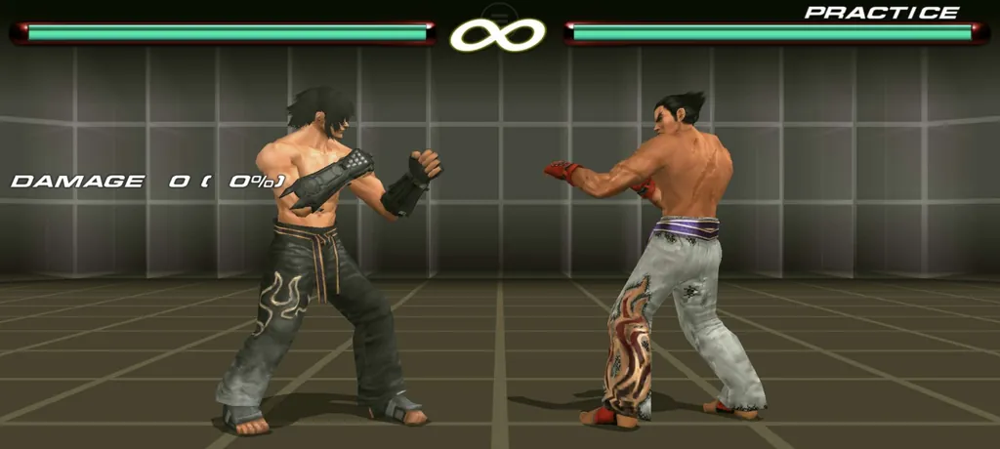

# Tekken 6 PPSSPP Aspect Ratio + Camera CWCheat

A lightweight CWCheat configuration for **Tekken 6 USA (`ULUS10466`)** on PPSSPP. It provides selectable aspect-ratio patches for common phone, tablet, and desktop displays plus adjustable gameplay camera widths.



> **Format:** CWCheat (`ULUS10466.ini`)  
> **Game:** Tekken 6 USA (`ULUS10466`)  
> **Emulator:** PPSSPP with cheats enabled

The cheat is device-agnostic: it patches the emulated game rather than targeting a specific phone, tablet, handheld, or computer.

The project is not affiliated with Bandai Namco Entertainment, Sony, or PPSSPP. Use your own legally obtained copy of Tekken 6.

## Features

- Nine selectable screen aspect ratios covering common ultrawide, phone, tablet, and widescreen formats.
- Four camera choices: Original, Slightly Wider, Wider, and Widest.
- Clean PPSSPP cheat-menu sections for Aspect Ratio, Camera, and Restore.
- Independent aspect-ratio and camera entries, so you can combine any supported ratio with your preferred camera.
- Restore entry for returning the aspect ratio and camera values to their defaults.
- Single-file CWCheat setup through `ULUS10466.ini`.

## Cheat menu

Recent PPSSPP versions recognize the section-title convention used by this file, so the cheat list is organized like this:

```text
ASPECT RATIO
  21:9
  20:9
  19.5:9
  19:9
  18.5:9
  18:9 (2:1)
  16:9
  16:10
  4:3

CAMERA
  Original
  Slightly Wider
  Wider
  Widest

RESTORE
  Restore Aspect + Camera
```

Use only **one aspect-ratio entry** and **one camera entry** at a time.

## Installation

1. In PPSSPP, enable **Cheats**.
2. Copy [`ULUS10466.ini`](ULUS10466.ini) into your active PPSSPP cheat folder:

   ```text
   PSP/Cheats/ULUS10466.ini
   ```

3. Start Tekken 6 USA (`ULUS10466`).
4. Set PPSSPP's display layout/scaling so the game fills the target display.
5. Open PPSSPP's **Cheats** menu.
6. Under **ASPECT RATIO**, enable the single entry that matches your display or PPSSPP output area.
7. Under **CAMERA**, optionally enable one camera preset.

If another Tekken 6 cheat modifies the same aspect-ratio or camera addresses, disable it to avoid conflicts.

## Supported aspect ratios

| Cheat entry | Typical use |
| --- | --- |
| `21:9` | Ultrawide monitors and desktop displays |
| `20:9` | Common modern phones |
| `19.5:9` | Common modern phones |
| `19:9` | Phones |
| `18.5:9` | Phones |
| `18:9 (2:1)` | Phones |
| `16:9` | Widescreen devices |
| `16:10` | Common Android tablets |
| `4:3` | Common tablet format |

All supported ratio entries use the same four game-code sites. Each entry changes only the embedded aspect-ratio value, keeping the patching method consistent across the supported ratios.

## Camera options

| Cheat entry | Effect |
| --- | --- |
| `Original` | Stock gameplay camera |
| `Slightly Wider` | Small increase in visible play area |
| `Wider` | Wider gameplay framing |
| `Widest` | Maximum included camera preset |

The camera presets use a separate gameplay-camera address, so changing the aspect ratio does not force a particular camera width.

## How the screen patch works

Each supported aspect-ratio entry writes its corresponding IEEE-754 value into the same four runtime sites.

| Ratio | Float value |
| --- | ---: |
| 21:9 | 2.3333333 |
| 20:9 | 2.2222222 |
| 19.5:9 | 2.1666667 |
| 19:9 | 2.1111112 |
| 18.5:9 | 2.0555556 |
| 18:9 | 2.0000000 |
| 16:9 | 1.7777778 |
| 16:10 | 1.6000000 |
| 4:3 | 1.3333334 |

## Compatibility

This repository targets the **USA release of Tekken 6 (`ULUS10466`)**. The addresses are specific to that game build and should not be assumed to work with other regional releases.

Because this is a CWCheat patch, it is not tied to a particular physical device. It can be used anywhere PPSSPP supports the same game build and CWCheat functionality.

For best geometry, choose the aspect-ratio entry matching the physical display or PPSSPP output area. A mismatched ratio will intentionally produce the wrong horizontal geometry.

## Limitations

- The aspect patch corrects the game's 3D projection for the selected output ratio.
- Tekken's original 2D HUD/menu layout is not independently repositioned or corrected.
- PPSSPP display scaling, texture packs, emulator settings, and other cheats can affect the final presentation.
- For a clean test after changing conflicting cheats, fully restart the game.

## Repository contents

```text
ULUS10466.ini
```

The repository intentionally remains focused on aspect-ratio correction and camera adjustment for Tekken 6 on PPSSPP.
