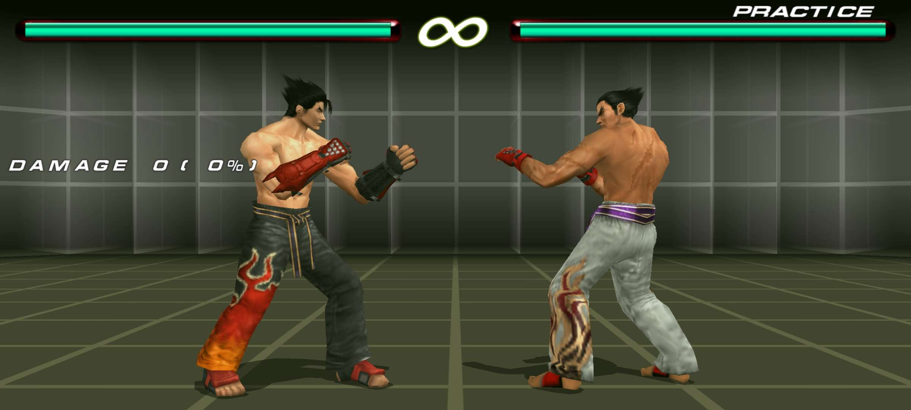

# Tekken 6 PPSSPP Aspect Ratio + Camera CWCheat

A CWCheat configuration for **Tekken 6 USA (`ULUS10466`)** on PPSSPP with selectable aspect ratios and adjustable gameplay camera widths.



> **Screenshot settings:** `20:9` aspect ratio + `Widest` camera

## Installation

1. Go to the [latest release](https://github.com/zxyandreay/tekken6-ultrawide/releases/latest) and download **`ULUS10466.ini`** from the **Assets** section.
2. Copy the file into your PPSSPP cheat folder:

   ```text
   PSP/Cheats/ULUS10466.ini
   ```

3. Open PPSSPP and make sure **Cheats** are enabled.
4. Go to **Settings → Graphics → Display layout & effects** and enable **Stretch** so the game fills your display.
5. Start **Tekken 6 USA (`ULUS10466`)** and open PPSSPP's **Cheats** menu.
6. Under **ASPECT RATIO**, enable **one** entry that matches your display or PPSSPP output area. For example, use **20:9** on a 20:9 phone or **21:9** on a 21:9 ultrawide monitor.
7. Under **CAMERA**, optionally enable **one** camera preset.

PPSSPP's **Stretch** option fills the display, while the matching aspect-ratio cheat corrects the game's 3D projection for that shape.

## Supported aspect ratios

| Cheat entry | Typical use |
| --- | --- |
| `21:9` | Ultrawide monitors and desktop displays |
| `20:9` | Common modern phones |
| `19.5:9` | Common modern phones |
| `19:9` | Phones |
| `18.5:9` | Phones |
| `18:9 (2:1)` | Phones |
| `16:9` | Widescreen devices |
| `16:10` | Common Android tablets |
| `4:3` | Common tablet format |

## Camera options

| Cheat entry | Effect |
| --- | --- |
| `Original` | Stock gameplay camera |
| `Slightly Wider` | Small increase in visible play area |
| `Wider` | Wider gameplay framing |
| `Widest` | Maximum included camera preset |

Use **Restore Aspect + Camera** from the cheat menu to return both settings to their defaults.

## Compatibility

This cheat targets the **USA release of Tekken 6 (`ULUS10466`)**. Other regional versions are not supported.

## Limitations

- The 3D aspect ratio is corrected, but Tekken 6's original 2D HUD and menu layout is not independently repositioned or corrected.
